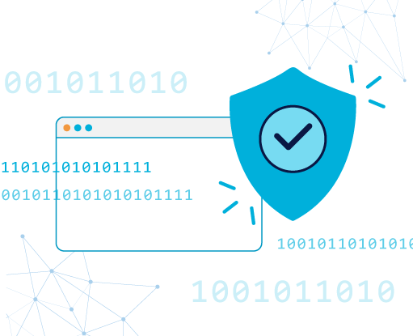
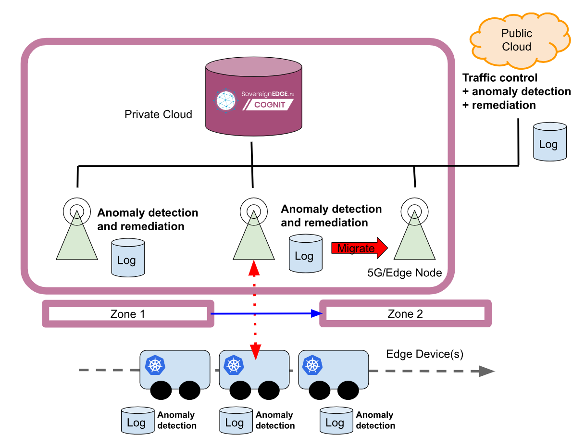

# Use Case 4 - CyberSecurity

Cybersecurity: Moving computation and data processing services to the edge, far from secured data centers, leaves systems exposed to new threats. Edge Computing requires a new generation of intelligent security mechanisms to be deployed along with edge applications, implementing advanced authentication and authorisation policies. This Use Case explores resilient anomaly detection and remediation in a smart mobility context. The main challenges will be the migration of workloads between edge nodes, and managing a DevSecOps pipeline in a multi-provider edge context with dynamic (geo-dependent) security policies.

All information regarding the jamming attack on the wifi are described in [Readme](wifi-jamming/README.md).
See also the related [Google Doc](https://docs.google.com/document/d/1SLovtQ420RU0NZxuNXsHVRes0hJmUBwpnXCAgbh3qLs/edit?pli=1)
