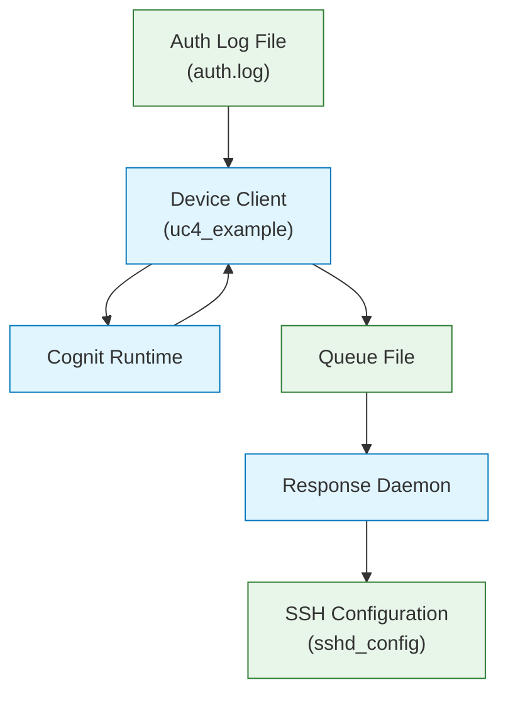

# Technical Documentation

## 1. Introduction

The example app is a device client implementation for the Cognit framework. It demonstrates how to deploy a security-focused anomaly detection system that monitors SSH authentication logs, detects suspicious activities, and takes automated actions to mitigate potential security threats.

This documentation explains the architecture, components, and workflow of the implementation, as well as testing procedures.

The example app is named *device client* in the following sections.

## 2. System Architecture

The implementation consists of two main components:

1. **Log Monitoring and Analysis System** - Monitors authentication logs, sends them to the Cognit framework for analysis, and processes the returned results
2. **Response Daemon** - Consumes detection events and takes appropriate security actions

### 2.1 High-Level Architecture Diagram




## 3. Component Details

### 3.1 Log Monitoring and Analysis System

The log monitoring system is implemented primarily in `uc4_example.py`. It performs the following functions:

1. Monitors the local authentication log file (`auth.log`) for new entries
2. Observes a requirements file for configuration changes
3. Sends new log entries to the Cognit framework for analysis
4. Processes the results returned by the Cognit framework
5. Writes detection events to a queue file for action handling

Key classes and their responsibilities:

- **LogHandler**: Watches the auth.log file for changes, extracts new log entries, and sends them to the Cognit framework for analysis
- **RequirementsHandler**: Monitors the requirements file for changes and register the need to update the Cognit runtime configuration
- **DeviceRuntime**: Interface to the Cognit framework, responsible for sending the anomaly detection function and log data to the framework

#### 3.1.1 Anomaly Detection Function

The anomaly detection function (`get_authentication_failures`) runs remotely in the Cognit framework's VM. It is defined in `log_analysis.py`. The function implements:

1. Log parsing and extraction of relevant fields (timestamps, usernames, IP addresses)
2. Feature extraction and normalization
3. Anomaly detection using Isolation Forest algorithm
4. Rule-based validation to reduce false positives
5. Severity determination based on user activity patterns, time of access, and IP addresses

The function returns a structured result containing:
- A summary message
- List of detected anomalies
- List of recommended actions/events

#### 3.1.2 Rules Configuration

The rules file (`rules.yml`) defines:

- Allowed users with their permitted time ranges for access
- Allowed IP addresses

This configuration is used by the anomaly detection function to evaluate whether logged events represent potential security threats.

### 3.2 Response Daemon

The Response Daemon (`response_action_daemon.py`) is a standalone service responsible for:

1. Monitoring the queue file for new events
2. Processing events based on severity and context
3. Implementing security actions (primarily blocking SSH access)
4. Managing the lifecycle of security actions (including automatic unblocking)

The daemon modifies the SSH server configuration (`sshd_config`) to implement two types of blocks:
- **Global blocks**: Deny access to a user from all IP addresses
- **IP-specific blocks**: Deny access to a user only from specific IP addresses

Additionally, the installation includes a command-line utility (`block-ssh-user`) that provides a manual interface for managing SSH blocks.

> **Note:** The Response Daemon is versioned in a separate Git repository named ["response-daemon"](https://git.cetic.be/cognit/uc4/response-daemon).

#### 3.2.1 Installation and Configuration

The Response Daemon is installed via the `install-response-daemon.sh` script, which:

1. Installs required dependencies
2. Creates necessary directories and configuration files
3. Sets up the systemd service (`response-daemon`) for automatic startup
4. Configures file permissions
5. Installs the command-line utility for manual control

## 4. System Workflow

### 4.1 Normal Operation Workflow

1. The device client starts and begins monitoring the auth.log file and requirements file
2. When new log entries appear, it extracts them and sends them to the Cognit framework
3. The Cognit framework executes the anomaly detection function in an isolated VM
4. The function analyzes the log entries and returns results (including any detected anomalies)
5. If anomalies are detected, the device client creates appropriate events in the queue file
6. The Response Daemon processes these events and implements security actions (e.g., blocking SSH access)
7. After the specified block duration expires, the Response Daemon automatically restores access

### 4.2 Configuration Change Workflow

1. The requirements file is updated with new parameters
2. The RequirementsHandler detects the change and register for future requirements update
3. Subsequent log analyses use the updated configuration

## 5. Testing Procedures

### 5.1 Testing with Log Entry Generator

The system includes a log entry generator script (`log_entry_and_config_updater.py`) that can be used to simulate SSH activity and test the anomaly detection capabilities. This interactive CLI tool provides several options:

1. Generate predefined normal and abnormal log entries
2. Create specific test scenarios:
   - User login outside allowed time range
   - User login from invalid IP address
   - Custom log entries with user-specified parameters
3. Update the requirements configuration

### 5.2 Testing Workflow

To test the anomaly detection and response system:

1. Start the device client (`uc4_example.py`) and ensure the Response Daemon is running
2. Use the log entry generator to create test scenarios:
   ```
   python log_entry_and_config_updater.py --log_file ./tmp/auth.log
   ```

3. Select the desired test scenario:
   - Option 2: Generate a login outside allowed time range
   - Option 3: Generate a login from an invalid IP
   - Option 4: Create a custom log entry

4. Confirm the addition of the log entry
5. Observe the device client output to verify that it detects the anomaly
6. Check the Response Daemon logs to confirm the appropriate action was taken:
   ```
   journalctl -u response-daemon -f
   ```

7. Test the expiration of blocks by waiting for the specified duration or manually unblocking using the CLI tool (`block-ssh-user`)

### 5.3 Configuration Testing

To test configuration updates:

1. Use option 5 in the log entry generator to modify requirements
2. Observe the Device Client to verify that it detects and applies the configuration change
3. Test log entries with the new configuration to verify the changes take effect

## 6. Security Considerations

- The Response Daemon runs with root privileges to modify SSH configuration
- Backup of SSH configuration is created before modifications
- Configuration changes are validated before application
- Failed configurations trigger automatic rollback to previous state
- Time-limited blocks prevent permanent lockouts
- Manual override available via the command-line utility (`block-ssh-user`)

## 7. Conclusion

The example demonstrates how the Cognit framework can be used to implement a practical security use case. By moving computation-intensive analysis to the Cognit framework while keeping security actions local, it provides a balanced approach to security automation.

The implementation showcases:
- Real-time log monitoring and analysis
- Dynamic configuration updates
- Automated security responses
- Integration between local systems and the Cognit framework
