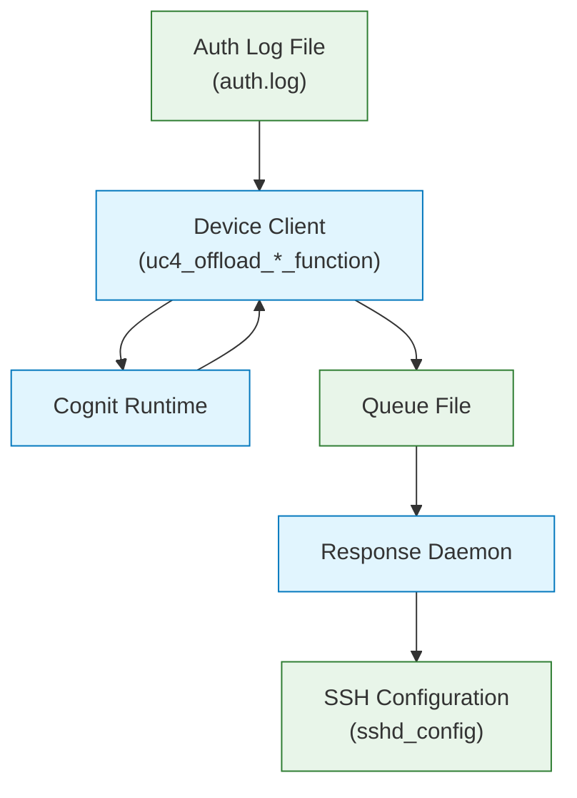

# Technical Documentation

## Overview

Device client implementation for the Cognit framework providing automated SSH authentication anomaly detection and response.

## System Architecture

Two main components:

1. **Log Monitoring System** (`uc4_offload_ad_function.py` / `uc4_offload_cc_function.py`) - Monitors auth logs, executes remote anomaly detection via Cognit framework
2. **Response Daemon** - Consumes detection events and implements SSH blocking actions

### Architecture Diagram




## Components

### Log Monitoring System (`uc4_offload_ad_function.py` / `uc4_offload_cc_function.py`)

**Key Classes:**
- **LogHandler**: Monitors `auth.log`, extracts entries, sends to Cognit framework
- **RequirementsHandler**: Tracks configuration changes
- **DeviceRuntime**: Cognit framework interface

**Anomaly Detection Function** (`decisionTree.py`):
Runs remotely in Cognit VM, implements:
- Log parsing (timestamps, usernames, IPs)
- Feature extraction and normalization
- Isolation Forest anomaly detection
- Rule-based validation (reduces false positives)
- Severity scoring

**Rules Configuration** (`rules.yml`):
- Allowed users and time ranges
- Permitted IP addresses

### Response Daemon

Standalone service that monitors queue file and implements SSH blocking via `sshd_config` modifications:
- **Global blocks**: Block user from all IPs
- **IP-specific blocks**: Block user from specific IPs
- Automatic unblocking after duration
- Manual control via `block-ssh-user` CLI utility

**Installation:** `install-response-daemon.sh` script sets up systemd service and dependencies.

> **Note:** Versioned in separate [response-daemon](https://git.cetic.be/cognit/uc4/response-daemon) repository.

## Workflow

**Normal Operation:**
1. Monitor `auth.log` and requirements file
2. Extract and send log entries to Cognit framework
3. Execute anomaly detection in isolated VM
4. Write detected anomalies to queue file
5. Response Daemon implements SSH blocks
6. Automatic unblock after duration expires

**Configuration Updates:**
1. Update requirements file
2. RequirementsHandler detects change
3. Apply new configuration to subsequent analyses

## Testing

**Test Tool:** `log_entry_and_config_updater.py`

```bash
python log_entry_and_config_updater.py --log_file ./tmp/auth.log
```

**Test Scenarios:**
- Login outside allowed time range
- Login from invalid IP
- Custom log entries
- Configuration updates

**Validation:**
```bash
journalctl -u response-daemon -f
```

## Security Features

- Root privileges for SSH config modifications
- Automatic config backup and validation
- Rollback on failed configurations
- Time-limited blocks prevent permanent lockouts
- Manual override via `block-ssh-user` CLI
- Computation offloaded to Cognit framework, actions remain local
